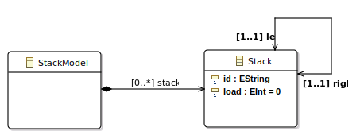

# MOMoT Extension for RL

This repository extends the core of the MOMoT framework ([source](https://github.com/martin-fleck/momot), [project page](http://martin-fleck.github.io/momot/)) to support reinforcement rearning (RL)
methods for rule-orchestrated model transformations. The project includes case studies of the original project
and adds 2 new ones, namely the Container Relocation Problem and the Pacman game. They are used to evaluate the RL agents against
the Non-Dominated Sorting Algorithm (NSGA-II) and demonstrate the feasibility of RL methods for search-based model optimization.

The following sections describe how RL approaches can be employed in general and how case studies are executed. The necessary steps are showcased by example of the Stack Load Balancing case.

- Overview
  - [Employ RL for problem cases](#2.1-how-the-rl-approaches-can-be-employed-for-problem-cases)
  - [Case Studies: How to run](#2.2-case-studies-how-to-run)
    - [Example: Stack Load Balancing](#example-stack-load-balancing)

## 1 Installation

A list of the required programs, how to set them up and how to configure the environment in order to support our project, and other preliminaries
can be found in **installation.pdf**.

## 2 How to use - General use of RL agents and case studies

### 2.1 How the RL approaches can be employed for problem cases

The new RL methods and required utilities are implemented in the MOMoT core plugins as provided in this project. The following examples show how one instantiates an agent for generic problem cases and for cases where the encoding for a neural network is provided.

#### 2.1.1 For generic learners

Generally, algorithms are employed for optimization in MOMoT by creating them with a corresponding "Factory" object first
and then adding them to the orchestration:

```java
// Create factory for evolutionary algorithms
final EvolutionaryAlgorithmFactory<TransformationSolution> moea = orchestration
            .createEvolutionaryAlgorithmFactory(populationSize);
// Add NSGA-II to orchestration
orchestration.addAlgorithm("NSGA-II",
    moea.createNSGAII(new TournamentSelection(2), new OnePointCrossover(1.0),
        new TransformationParameterMutation(0.1, orchestration.getModuleManager()),
        new TransformationPlaceholderMutation(0.2))
);
```

For the RL agents, an environment (_IEnvironment_) instance has to be available for the respective
approach. For that matter, a builder is established with with the artifacts required to enable an environment
and the instantiated envrionments are further passed to initialize the _RLAlgorithmFactory_:

```java
// Init builder with fitness function
final EnvironmentBuilder<TransformationSolution> envBuilder = new EnvironmentBuilder<>(fitnessFunction);

// Build enviroments (For single- and multi-objective optimization)
final Map<IEnvironment.Type, IEnvironment<TransformationSolution>> env = envBuilder
        .singleObjective("Standard Deviation")
        .build();

final RLAlgorithmFactory<TransformationSolution> rlFactory = orchestration.createRLAlgorithmFactory(env);
```

Note that the name of the optimization objective (congruent with an objective in _fitnessFunction_) is passed to enable the environment for single-objective RL methods.
Then the algorithm can be created and added to the evaluation as usual. The basic Q-Learning agent, for example, is instantiated as follows:

```java
// Add basic Q-Learning algorithm with parameters gamma, epsilon, etc.
orchestration.addAlgorithm("QLearning", rlFactory.createSingleObjectiveQLearner(0.9, 0.9, true, 1e-4, 0.1, ...);
```

#### 2.1.2 For policy-based learners with domain-specific encodings (like the Container Relocation Problem)

In order to use the policy-based approach, a reward function and an encoding for the domain model
have to be provided to the builder. This requires implementing a class deriving from class _IEncodingStrategy_ (e.g., see _PacmanEncodingStrategy.java_ in _at.ac.tuwien.big.momot.core_ package). Such a class defines how the network inputs are derived from a model state, the rewards issued on certain rule applications, and one can further specify rule dependencies such that, for example, the rule _eat_ and _kill_ need to be applied after each step done by the Pacman if possible, i.e., if a field with food or a ghost was entered. The utilities are added to the builder as follows:

```java
// Init builder with fitness function
final EnvironmentBuilder<TransformationSolution> envBuilder = new EnvironmentBuilder<>(fitnessFunction);

// Build enviroments with encoding and reward strategy (For multi-objective and domain-specific optimization)
final Map<IEnvironment.Type, IEnvironment<TransformationSolution>> env = envBuilder
        .encodingStrategy(EncodingFactory.createEncoder(ContainerEncodingStrategy.class))
        .rewardStrategy(RewardFactory.createRewardStrategy(ContainerRewardStrategy.class))
        .build();

// Create factory with environment
final RLAlgorithmFactory<TransformationSolution> rlFactory = orchestration.createRLAlgorithmFactory(env);
// Add policy gradient agent (or others from rlFactory) with parameters gamma, learning rate, logging paths ..
orchestration.addAlgorithm("PG", rlFactory.createPolicyGradient(0.95, 1e-4, ...));
```

### 2.2 Case Studies: How to run

Generally, MOMoT requires a search configuration which defines the (problem) model instance, a set of transformation rules,
objectives, constraints, and a selection of algorithms to execute an experiment. As the RL agents are not yet part of the configuration language
provided for MOMoT, the configurations are contained in single static .java files.

The metamodel, model instances, and rules for four different example cases are present in the repository:

- Stack Load Balancing -> _at.ac.tuwien.big.momot.examples.stack/src/at.ac.tuwien.big.momot.examples.stack_ (**main: StackSearch.java**)
- Class Responsibility Assignment -> _at.ac.tuwien.big.momot.examples.cra/src/icmt.tool.momot.demo_ (**main: ArchitectureSearch.java**)
- OO-Refactoring -> _at.ac.tuwien.big.momot.examples.refactoring/src/at.ac.tuwien.big.momot.examples.refactoring_ (**main: RefactoringSearch.java**)
- Container Relocation Problem-> _org.container/src/container.demo_ (**main: ContainerSearch.java**)
- Pacman Game -> _org.pacman/src/PacmanGame.search_ (**main: PacmanSearch.java**)

The "main"-files contain an executable search setup, respectively, such that would naturally be generated according to a search configuration using a configuration language specific to MOMoT. In these setups, one can change the initial model instance (_INITIAL_MODEL_), maximum transformation length (_SOLUTION_LENGTH_), and the population size (_POPULATION_SIZE_) used for NSGA-II. _MAX_EVALUATIONS_ and _NR_RUNS_ define the maximum number of solution evaluations per trial and the number of trials for the experiment. The search algorithms (including the contributed RL agents) and corresponding parameters are added in method _createOrchestration(...)_.

Upon running a "main"-file, the setup will be executed and the experiment settings printed to the Eclipse console. Furthermore,
the console shows runtime progress regarding the currently executed trial for all algorithms. After the last trial, summary statistics
will be printed to enable a performance comparison between tested algorithms. Printed metrics include the average and maximum hypervolume obtained in the runs and a combined pareto set of solutions where the best objective value can be observed.

#### Example: Stack Load Balancing

Resources for this example are to be found in the project _at.ac.tuwien.big.momot.examples.stack_. Hereby, a _StackModel_ (_stack.ecore_ in _model_ folder) consists of up to multiple *Stack*s with a load each. The goal in this case is to apply shift-operations in form of two rules, _shiftLeft_ and _shiftRight_, where a certain amount is
transfered from the source stack to its left or right neighbour, i.e., the target stack. Note that the shift amount is chosen randomly by the Henshin Engine but set to a maximum of 5 units in one transformation step for this problem domain. (see _StackOrchestration.java_ in _src\at\ac\tuwien\big\momot\examples\stack_).

<figure>


<figcaption><b>Meta-Model: Stack Load Balancing Case Study</b></figcaption>
</figure>

There are four different problem instances provided in the _model_-folder with varying number of stacks. Each of them can be set for the _INPUT_MODEL_ in _StackSearch.java_ (_src\at\ac\tuwien\big\momot\examples\stack_). Additionally, other parameters concerning the experiment setting can be changed as requested. For example, using the model with five stacks as initial problem instance, allowing for up to 8 shift operations, and repeating the experiment 3 times with 5,000 iterations each, we set the variables in _StackSearch.java_ as follows:

```java
private static final int SOLUTION_LENGTH = 8;
private static final String INPUT_MODEL = "model_five_stacks.xmi";
private static final int NR_RUNS = 3;
private static final int MAX_EVALUATIONS = 5000;
```

When we execute this, the output looks as follows:

<details>
  <summary>Click to show console output</summary>
  
  ```
  -------------------------------------------------------
Search
-------------------------------------------------------
Objectives:      [Standard Deviation, SolutionLength]
NrObjectives:    2
Constraints:     []
NrConstraints:   0
Transformations: [Stack]
Units:           [Rule shiftLeft(fromId, toId, amount, fromLoad, toLoad), Rule shiftRight(fromId, toId, amount, fromLoad, toLoad)]
SolutionLength:  8
PopulationSize:  100
Iterations:      50
MaxEvaluations:  5000
AlgorithmRuns:   3
---------------------------
Run 'NSGAII' 3 times...
[05:05:00.119] Run 1 of 3 started.
[05:05:03.081] Run 1 of 3 terminated after 00:00:02.955 (2955 ms).
[05:05:03.083] Run 2 of 3 started.
[05:05:03.842] Run 2 of 3 terminated after 00:00:00.758 (758 ms).
[05:05:03.843] Run 3 of 3 started.
[05:05:04.467] Run 3 of 3 terminated after 00:00:00.624 (624 ms).
[05:05:04.469] Total runtime for 3 seeds: 00:00:04.350 (4350 ms).
Run 'QLearningExplore' 3 times...
[05:05:04.485] Run 1 of 3 started.
[05:05:06.183] Run 1 of 3 terminated after 00:00:01.696 (1696 ms).
[05:05:06.189] Run 2 of 3 started.
[05:05:07.783] Run 2 of 3 terminated after 00:00:01.594 (1594 ms).
[05:05:07.784] Run 3 of 3 started.
[05:05:09.438] Run 3 of 3 terminated after 00:00:01.653 (1653 ms).
[05:05:09.439] Total runtime for 3 seeds: 00:00:04.954 (4954 ms).
Run 'QLearning' 3 times...
[05:05:09.442] Run 1 of 3 started.
[05:05:11.886] Run 1 of 3 terminated after 00:00:02.444 (2444 ms).
[05:05:11.888] Run 2 of 3 started.
[05:05:14.215] Run 2 of 3 terminated after 00:00:02.327 (2327 ms).
[05:05:14.217] Run 3 of 3 started.
[05:05:16.624] Run 3 of 3 terminated after 00:00:02.407 (2407 ms).
[05:05:16.626] Total runtime for 3 seeds: 00:00:07.183 (7183 ms).
-------------------------------------------------------
Analysis
-------------------------------------------------------
---------------------------
Analysis Results
---------------------------
NSGAII:
    Hypervolume: 
        Aggregate: 0.4989877579547276
        Min: 0.4804635643013558
        Median: 0.4989877579547276
        Max: 0.4989877579547276
        Mean: 0.492813026736937
        StandardDeviation: 0.01069494819229498
        Variance: 1.1438191683587365E-4
        Count: 3
        Indifferent: [QLearningExplore, QLearning]
        EffectSize: [
            - { measure: CohensD, algorithm: QLearningExplore, effectSize: 0.816496580927726, magnitude: large }
            - { measure: CliffsDelta, algorithm: QLearningExplore, effectSize: 0.3333333333333333, magnitude: medium }
            - { measure: VarghaDelaneyA, algorithm: QLearningExplore, effectSize: 0.3333333333333333 }
            - { measure: CohensD, algorithm: QLearning, effectSize: 1.779545233537748, magnitude: large }
            - { measure: CliffsDelta, algorithm: QLearning, effectSize: 0.7777777777777778, magnitude: large }
            - { measure: VarghaDelaneyA, algorithm: QLearning, effectSize: 0.8888888888888888 }
        ]
        Values: [0.4989877579547276, 0.4989877579547276, 0.4804635643013558]
QLearningExplore:
    Hypervolume: 
        Aggregate: 0.4989877579547276
        Min: 0.4989877579547276
        Median: 0.4989877579547276
        Max: 0.4989877579547276
        Mean: 0.4989877579547276
        StandardDeviation: 0.0
        Variance: 0.0
        Count: 3
        Indifferent: [NSGAII, QLearning]
        EffectSize: [
            - { measure: CohensD, algorithm: NSGAII, effectSize: 0.816496580927726, magnitude: large }
            - { measure: CliffsDelta, algorithm: NSGAII, effectSize: 0.3333333333333333, magnitude: medium }
            - { measure: VarghaDelaneyA, algorithm: NSGAII, effectSize: 0.6666666666666666 }
            - { measure: CohensD, algorithm: QLearning, effectSize: 4.538540534168039, magnitude: large }
            - { measure: CliffsDelta, algorithm: QLearning, effectSize: 1.0, magnitude: large }
            - { measure: VarghaDelaneyA, algorithm: QLearning, effectSize: 1.0 }
        ]
        Values: [0.4989877579547276, 0.4989877579547276, 0.4989877579547276]
QLearning:
    Hypervolume: 
        Aggregate: 0.48477364423394687
        Min: 0.4727905920581036
        Median: 0.4727905920581036
        Max: 0.48477364423394687
        Mean: 0.4767849427833847
        StandardDeviation: 0.006918418399436447
        Variance: 4.786451314966077E-5
        Count: 3
        Indifferent: [NSGAII, QLearningExplore]
        EffectSize: [
            - { measure: CohensD, algorithm: NSGAII, effectSize: 1.779545233537748, magnitude: large }
            - { measure: CliffsDelta, algorithm: NSGAII, effectSize: 0.7777777777777778, magnitude: large }
            - { measure: VarghaDelaneyA, algorithm: NSGAII, effectSize: 0.1111111111111111 }
            - { measure: CohensD, algorithm: QLearningExplore, effectSize: 4.538540534168039, magnitude: large }
            - { measure: CliffsDelta, algorithm: QLearningExplore, effectSize: 1.0, magnitude: large }
            - { measure: VarghaDelaneyA, algorithm: QLearningExplore, effectSize: 0.0 }
        ]
        Values: [0.48477364423394687, 0.4727905920581036, 0.4727905920581036]
---------------------------
- Save Analysis to 'output/analysis/analysis.txt'
- Save Indicator BoxPlots to 'output/analysis/'
-------------------------------------------------------
Results
-------------------------------------------------------
REFERENCE SET:

2.8284271247461903 0.0
2.0976176963403033 1.0
0.6324555320336759 3.0
0.8944271909999159 2.0
0.0 5.0

- Save objectives of all algorithms to 'output/objectives/objective_values.txt'
- Save models of all algorithms to 'output/models/'
- Save objectives of algorithms seperately to 'output/objectives/<algorithm>.txt'
- Save models of algorithms seperately to 'output/solutions/<algorithm>.txt'´

QLearning
2.8284271247461903 0.0
2.0976176963403033 1.0
1.0954451150103321 2.0
0.6324555320336759 3.0

NSGAII
0.6324555320336759 3.0
2.8284271247461903 0.0
2.0976176963403033 1.0
0.8944271909999159 2.0
0.0 5.0

QLearningExplore
2.8284271247461903 0.0
0.0 5.0
2.0976176963403033 1.0
0.6324555320336759 3.0
0.8944271909999159 2.0

```
</details>
```
